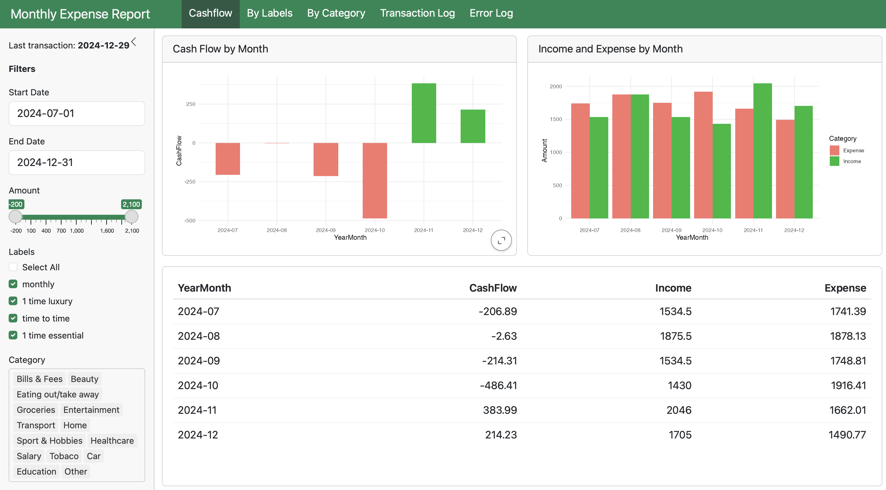

# Monthly Expense Report

*synthetic data are used in this project*
  
## Project Overview

### Data Cleaning (Python):
Python script is used to clean, preprocess, and merge monthly data downloaded from Spendee. 
Multiple monthly data files are concatenated into a single master file for analysis. 

### Interactive Dashboard (R):
An interactive Quarto Shiny dashboard is built using R to provide a visual breakdown of spending and income by category for each month.
The dashboard allows users to explore trends, identify patterns, and view detailed visualizations of their financial data. 
